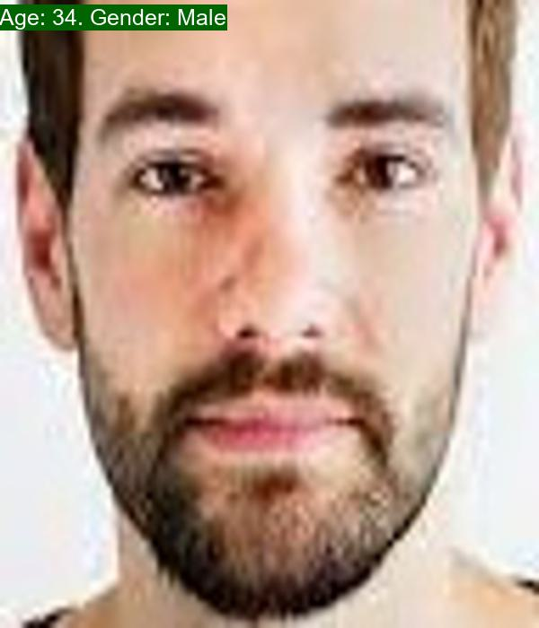
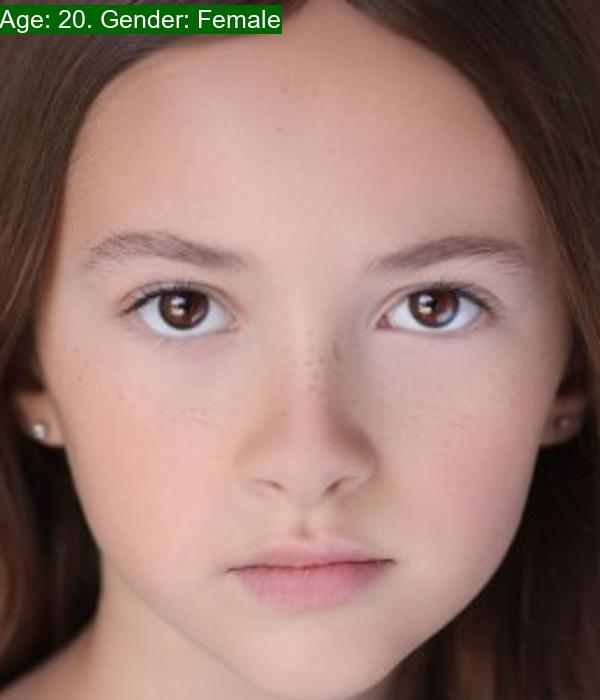
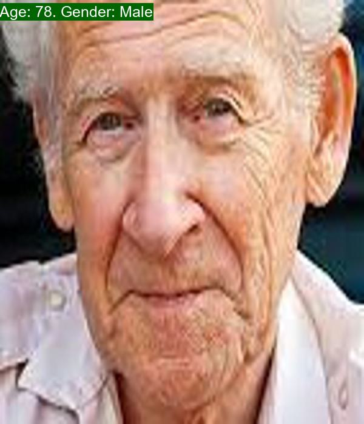

<p align="center">
 <h1 align="center">Age-and-Gender-Prediction</h1>
</p>


## Introduction
Age and gender prediction from facial images is a challenging computer vision task with various applications, including face recognition, targeted marketing, and user experience personalization. In this project, we have implemented a deep learning model to predict the age and gender of individuals from facial images.





## Data
Data used for this project consists of images of 10 different types of flowers. You can find it at <a href="https://www.kaggle.com/datasets/nipunarora8/age-gender-and-ethnicity-face-data-csv?select=age_gender.csv">this link</a>

I have processed that data so that it can be used for model training in **dataset.py**

## Model
I use a simple CNN architecture for image classification. The model architecture is defined in the **models.py** file.

## Training
You can train the model by running the following command:
```
python train.py -r path/to/age/gender/dataset
```
Replace path/to/age/gender/dataset with the path to your dataset.

After training, the model's accuracy on the test set will be displayed, and the best model (**best_model.pt**) will be saved in the **trained_models** directory.

## Trained Models
You can find trained models I have trained in <a href="https://drive.google.com/drive/folders/12zUspjpC2t8SNh4J9NLfrtcVFPCkItJm?usp=sharing">this link</a>

## Experiments
I trained the model for 100 epochs an the best model of arccuracy is **0.8027210884353742**

Loss/iteration during training & Accuracy/epoch during validation


## Testing
You can test the model with images in **test_image** by running the following command:
```
python test.py -p path/to/test/image
```
Replace path/to/test/image with the path to your test image.
### Result

&nbsp;&nbsp;&nbsp;

## Requirements
- Python
- PyTorch
- scikit-learn
- PIL
- tensorboard
