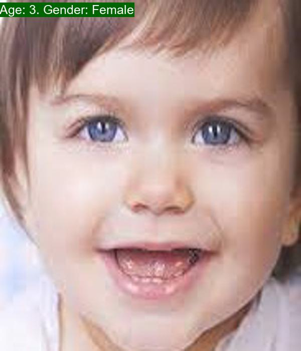
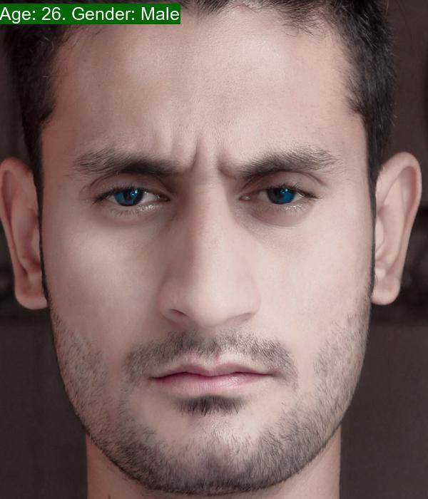
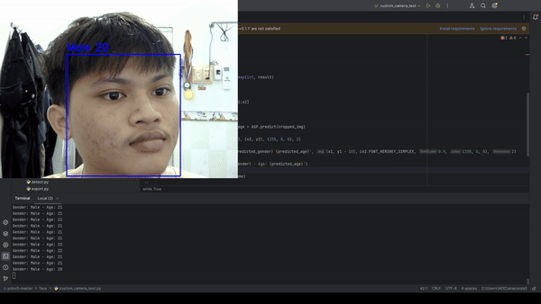
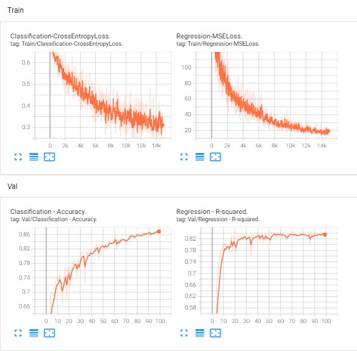

<p align="center">
 <h1 align="center">Age-and-Gender-Prediction</h1>
</p>


## Introduction
This repository contains a deep learning project for predicting age and gender from facial images. The project is implemented using PyTorch and includes a custom convolutional neural network (CNN) architecture.




<p align="center">
  
</p>

## Data
<a href="https://www.kaggle.com/datasets/nipunarora8/age-gender-and-ethnicity-face-data-csv?select=age_gender.csv">The data</a> used for this project is a dataframe that includes columns such as age, ethnicity, gender, img_name, and pixels. However, in this project, we are only concerned with the columns age, gender, and pixels. 

I have processed that data so that it can be used for model training in **dataset.py**.

## Model
I have built a simple CNN model that can predict the age and gender of a person from an input facial image. The model is designed to perform both classification and regression tasks simultaneously.

The model architecture is defined in the **models.py** file.

## Training
You can train the model by running the following command:
```
python train.py -r path/to/age/gender/dataset
```
Replace path/to/age/gender/dataset with the path to your dataset.

After training, the model's accuracy on the test set will be displayed, and the best model will be saved in the **trained_models** directory.

## Experiments
I trained the model for 100 epochs and the best model has an accuracy score of **0.868** for the gender classification task and an R-square score of **0.839** for the age prediction task.

Loss/iteration during training & Accuracy/epoch during validation.


**Compare with other model**
||Custom CNN|Fine-tuning ResNet50|
|-----------|:-----------:|:-----------:|
|Classification task/Accuracy|0.868|0.864|
|Regression task/R-square|0.839|0.914|

## Testing
You can test the model with images in **test_image** by running the following command:
```
python test.py -p path/to/test/image
```
Replace path/to/test/image with the path to your test image.

## Requirements
- Python
- PyTorch
- scikit-learn
- PIL
- tensorboard
